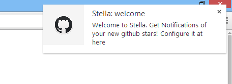
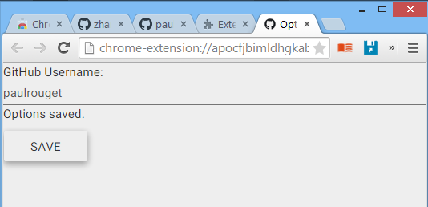
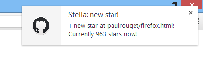

#Stella
Chrome Extension - Notifications of your new github stars!

#Screenshots
###Welcome

###Options
Configure your github username here:

###Notification
Then you can get notifications if there is any new star in repos according to your username set in options.

### Feedback
Welcome to raise an issue [here](https://github.com/zhangdanyangg/stella/issues) if you have any feedback.